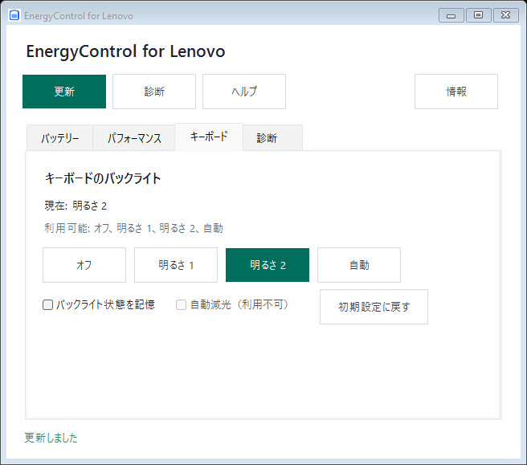

# EnergyControl for Lenovo

[English](README.md) | [简体中文](README.zh-CN.md) | 日本語

[](https://github.com/ethandong16/EnergyControl-for-Lenovo/actions/workflows/ci.yml)
[](https://github.com/ethandong16/EnergyControl-for-Lenovo/releases)
[](LICENSE)

EnergyControl for Lenovo は、対応する Lenovo ノート PC 向けの非公式 Windows ポータブルツールです。GUI とコマンドラインから、充電モード、パフォーマンスモード、充電しきい値、キーボードバックライトを操作できます。

利用できる機能は、機種、ファームウェア、ドライバー、インストール済みの Lenovo コンポーネントによって異なります。Lenovo の非公開 DLL、テレメトリ、常駐サービス、インストーラー、自動更新は含みません。

## はじめに

1. [Releases](https://github.com/ethandong16/EnergyControl-for-Lenovo/releases) から Windows x64 ZIP をダウンロードして展開します。
2. `Get-FileHash .\<ダウンロードしたファイル>.zip -Algorithm SHA256` で確認します。
3. `EnergyControl.exe` を実行して GUI を開くか、PowerShell からコマンドラインを使用します。

Windows 10/11 x64 と .NET Framework 4.8 が必要です。リリースは未署名のプレビュービルドです。

## 機能

| 機能 | 例 | 利用条件 |
| --- | --- | --- |
| 充電モード | 通常、バッテリー保護、急速充電 | 対応する EnergyDrv / ACPIVPC ドライバーまたは Lenovo Addin |
| 充電しきい値 | 開始・停止割合 | オプションの Lenovo Power RPC サービスとファームウェア |
| パフォーマンス | 自動、静音、高性能、エキスパート | 対応する Lenovo Addin |
| キーボードバックライト | オフ、レベル 1、レベル 2、自動 | 対応する IdeaNotebookAddin とファームウェア |
| 診断 | 状態、能力、エラー | 利用可能なインターフェースの読み取り専用検査 |

バッテリー保護モードの上限はファームウェアによって決まり、任意の割合を設定できるとは限りません。利用できない機能は無効になり、他の機能には影響しません。

## デスクトップ画面

GUI は起動時の Windows 表示言語に従います。`zh-*` は簡体字中国語、`ja-*` は日本語、それ以外は英語です。ヘルプボタンは選択中の言語で付属の `README.html` を開きます。画面にはバッテリー、パフォーマンス、キーボード、診断のタブがあります。

設定変更には確認が必要で、適用後にデバイス状態を再読み込みします。対応しない操作は無効になり、利用できない充電しきい値の入力欄は非表示になります。



画像はレイアウト検証用のシミュレーションデータを使用しています。実際の機能は端末によって異なります。

## コマンドライン

読み取り専用の例：

```powershell
.\EnergyControl.exe status
.\EnergyControl.exe diagnose
.\EnergyControl.exe charge direct get
.\EnergyControl.exe charge threshold get
.\EnergyControl.exe performance get
.\EnergyControl.exe keyboard-backlight get
```

書き込みには必ず `--apply` が必要です：

```powershell
.\EnergyControl.exe charge direct set conservation --apply
.\EnergyControl.exe charge threshold set 75 80 --apply
.\EnergyControl.exe performance set quiet --apply
.\EnergyControl.exe keyboard-backlight set level1 --apply
.\EnergyControl.exe keyboard-backlight restore-default --apply
```

利用できる値には `normal`、`conservation`、`express`、`auto`、`quiet`、`performance`、`geek`、`off`、`level1`、`level2` があります。完全な一覧は `EnergyControl.exe help` で確認できます。

## ビルドと検証

Windows で SDK スタイルの `net48` プロジェクトをビルドできる .NET SDK と、テストスクリプト用の PowerShell 7 を使用してください。コンパイルとシミュレーションテストに Lenovo DLL は必要ありません。

```powershell
.\build.ps1
.\tests\run-tests.ps1
.\verify-layout.ps1
```

ポータブル実行ファイルは `artifacts\publish\EnergyControl.exe` に生成されます。ビルド時には三つの README からオフライン多言語ヘルプも生成されます。

## プロジェクトの方針

[コントリビューション](CONTRIBUTING.md)、[セキュリティ](SECURITY.md)、[免責事項](DISCLAIMER.md)、[変更履歴](CHANGELOG.md)を参照してください。

[GPL-3.0-only](LICENSE) で公開しています。Lenovo は互換性を説明するためだけに記載しており、本プロジェクトは Lenovo と提携しておらず、承認も受けていません。
