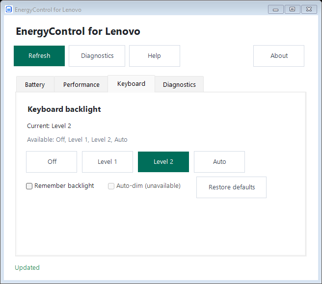

# EnergyControl for Lenovo

English | [简体中文](README.zh-CN.md) | [日本語](README.ja.md)

[](https://github.com/ethandong16/EnergyControl-for-Lenovo/actions/workflows/ci.yml)
[](https://github.com/ethandong16/EnergyControl-for-Lenovo/releases)
[](LICENSE)

EnergyControl for Lenovo is an unofficial portable Windows utility for compatible Lenovo laptops. It provides a desktop interface and command-line tools for charging modes, performance modes, charge thresholds and keyboard backlight controls.

Available controls depend on the laptop model, firmware, drivers and installed Lenovo components. The application does not include Lenovo private DLLs, telemetry, a background service, an installer or an automatic updater.

## Get started

1. Download and extract the Windows x64 ZIP from [Releases](https://github.com/ethandong16/EnergyControl-for-Lenovo/releases).
2. Verify it with `Get-FileHash .\<downloaded-file>.zip -Algorithm SHA256`.
3. Run `EnergyControl.exe` for the desktop interface, or use the command line in PowerShell.

Windows 10/11 x64 and .NET Framework 4.8 are required. Releases are unsigned preview builds.

## Features

| Feature | Examples | Availability |
| --- | --- | --- |
| Charging modes | Normal, conservation, express | Compatible EnergyDrv / ACPIVPC driver or Lenovo Addin |
| Charge thresholds | Start and stop percentages | Optional Lenovo Power RPC service and firmware support |
| Performance modes | Auto, quiet, performance, geek | Compatible installed Lenovo Addin |
| Keyboard backlight | Off, level 1, level 2, auto | Compatible IdeaNotebookAddin and firmware |
| Diagnostics | Device state, capabilities and errors | Read-only checks of available integrations |

Conservation mode uses a firmware-defined limit and does not imply arbitrary percentage support. Unsupported features remain unavailable and do not prevent other features from working.

## Desktop interface

The GUI follows the Windows display language at startup: `zh-*` uses Simplified Chinese, `ja-*` uses Japanese, and other languages use English. The Help button opens the bundled `README.html` in the selected language. The interface includes Battery, Performance, Keyboard and Diagnostics tabs.

Changes require confirmation and are followed by a fresh device read. Unsupported actions are disabled, and unavailable threshold controls are hidden.



The screenshot uses simulated device data for layout verification. Available controls depend on the local machine.

## Command line

Read-only examples:

```powershell
.\EnergyControl.exe status
.\EnergyControl.exe diagnose
.\EnergyControl.exe charge direct get
.\EnergyControl.exe charge threshold get
.\EnergyControl.exe performance get
.\EnergyControl.exe keyboard-backlight get
```

Every write requires `--apply`:

```powershell
.\EnergyControl.exe charge direct set conservation --apply
.\EnergyControl.exe charge threshold set 75 80 --apply
.\EnergyControl.exe performance set quiet --apply
.\EnergyControl.exe keyboard-backlight set level1 --apply
.\EnergyControl.exe keyboard-backlight restore-default --apply
```

Accepted values include `normal`, `conservation`, `express`, `auto`, `quiet`, `performance`, `geek`, `off`, `level1` and `level2`. Run `EnergyControl.exe help` for the complete command reference.

## Build and verify

Use a .NET SDK that can build SDK-style `net48` projects on Windows and PowerShell 7 for the test scripts. Lenovo DLLs are not required to compile or run the simulated tests.

```powershell
.\build.ps1
.\tests\run-tests.ps1
.\verify-layout.ps1
```

The portable executable is generated at `artifacts\publish\EnergyControl.exe`. The build also generates offline multilingual help from the three README files.

## Project policies

See [Contributing](CONTRIBUTING.md), [Security](SECURITY.md), [Disclaimer](DISCLAIMER.md) and [Changelog](CHANGELOG.md).

Licensed under [GPL-3.0-only](LICENSE). Lenovo is referenced only to describe compatibility. This project is not affiliated with or endorsed by Lenovo.
