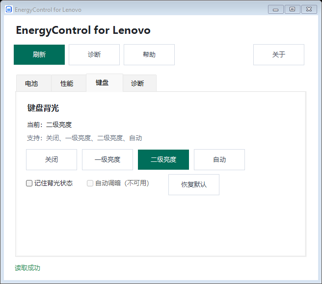

# EnergyControl for Lenovo

[English](README.md) | 简体中文 | [日本語](README.ja.md)

[](https://github.com/ethandong16/EnergyControl-for-Lenovo/actions/workflows/ci.yml)
[](https://github.com/ethandong16/EnergyControl-for-Lenovo/releases)
[](LICENSE)

用于兼容联想笔记本的 Windows 便携工具，集中管理充电、性能模式和键盘背光。同一个可执行文件提供中文、英文、日文图形界面与命令行。

本项目由社区维护，非联想官方软件；不分发 Lenovo 私有 DLL，不包含遥测、后台服务、安装器或自动更新。

## 快速开始

1. 从 [Releases](https://github.com/ethandong16/EnergyControl-for-Lenovo/releases) 下载并解压 Windows x64 ZIP。
2. 用 `Get-FileHash .\<下载的文件>.zip -Algorithm SHA256` 计算校验值，与随附的校验文件对照。
3. 双击 `EnergyControl.exe` 打开 GUI，或在 PowerShell 中运行 `.\EnergyControl.exe diagnose`。

需要 Windows 10/11 x64 和 .NET Framework 4.8。发布包未签名；`main` 分支可能包含最新发布包尚未提供的更改。

## 功能与依赖

| 功能 | 可用设置 | 运行时依赖 |
| --- | --- | --- |
| 充电模式 | 常规、养护、快充 | 兼容的 Lenovo EnergyDrv / ACPIVPC 驱动；可选 Addin 回退 |
| 充电阈值（实验） | 起充、停充百分比 | Lenovo Power RPC 服务及固件支持 |
| 性能模式（实验） | 自动、安静、高性能、极客或创作 | 已安装的兼容 Lenovo Addin |
| 键盘背光（实验） | 关闭、一级、二级、自动；记住状态、自动调暗、恢复默认 | 已安装的兼容 IdeaNotebookAddin 及固件 |
| 诊断 | 接口可用性、状态与错误 | 各集成接口独立查询 |

可用设置因机型而异。养护模式的停充限制由固件决定，**不等同于支持任意百分比阈值**。性能自动切换另有 CLI 命令。

背光接口已在 IdeaNotebookAddin `1.0.13.79` 上完成只读验证：样本设备报告 `TwoLevelsAuto`，不支持自动调暗。请求构造已测试，尚未完成跨机型硬件写入验证。详见[兼容性说明](COMPATIBILITY.md)和[背光接口记录](KEYBOARD_BACKLIGHT_INTERFACE.md)。

## 图形界面

GUI 启动时跟随 Windows 显示语言：中文（`zh-*`）使用简体中文，日文（`ja-*`）使用日文，其余语言回退到英文。日期、数字等区域格式不影响界面语言。

**帮助**按钮会以相同语言打开随附的 `README.html`。直接打开 [README.html](README.html) 时按浏览器首选语言显示，也可手动切换。GitHub 的 Markdown 是静态页面，不能按系统语言自动选择 README，请使用顶部语言链接。若本地帮助缺失，帮助按钮会通过浏览器打开对应语言的 GitHub README。

界面分为电池、性能、键盘和诊断四个标签页。刷新入口和状态提示始终可见；模式选项反映最近读取的设备状态，复选框用于背光开关。不支持的操作会禁用，不可用的充电阈值编辑器会隐藏。

每次修改都需要确认，应用后重新读取设备状态。诊断页保留完整错误信息和读取时间；切换标签页不会访问硬件。



*当前源码 GUI，使用模拟设备数据进行布局验证；实际可用控件取决于本机能力。*

## 命令行

只读查询：

```powershell
.\EnergyControl.exe status
.\EnergyControl.exe diagnose
.\EnergyControl.exe charge direct get
.\EnergyControl.exe charge threshold get
.\EnergyControl.exe performance get
.\EnergyControl.exe keyboard-backlight get
.\EnergyControl.exe keyboard-backlight capability
```

所有写入都需要 `--apply`。下面是独立示例，按需选择单条执行：

```powershell
.\EnergyControl.exe charge direct set conservation --apply
.\EnergyControl.exe charge threshold set 75 80 --apply
.\EnergyControl.exe performance set quiet --apply
.\EnergyControl.exe performance auto-transition on --apply
.\EnergyControl.exe keyboard-backlight set level1 --apply
.\EnergyControl.exe keyboard-backlight reserve on --apply
.\EnergyControl.exe keyboard-backlight auto-dim on --apply
.\EnergyControl.exe keyboard-backlight restore-default --apply
```

| 命令 | 可选值 |
| --- | --- |
| `charge direct set` 或 `charge set` | `normal`、`conservation`、`express` |
| `performance set` | `auto`、`quiet`、`performance`、`geek` |
| `keyboard-backlight set` | `off`、`level1`、`level2`、`auto` |
| `reserve`、`auto-dim`、`performance auto-transition` | `on`、`off` |

`charge get/set` 使用可选 Addin，`charge direct get/set` 使用 EnergyDrv。`backlight` 是 `keyboard-backlight` 的别名。运行 `help` 查看命令列表。退出码：`0` 成功，`1` 操作失败或缺少 `--apply`，`2` 命令或模式无效。

## 故障排查

| 现象 | 检查项 |
| --- | --- |
| 未找到 IdeaNotebookAddin | 安装或修复兼容的 Lenovo Vantage 组件；仅安装百应不代表此 Addin 已存在。 |
| Power RPC 错误 `1722` | 所需 RPC 服务不可用；直接驱动充电功能仍可独立使用。 |
| 无法打开 EnergyDrv | 检查 Lenovo ACPIVPC 驱动及访问权限。 |
| 功能不可用或设置被拒绝 | 查看诊断和固件能力，不要根据其他机型推断本机支持。 |

本地集成测试可通过 `LENOVO_SETTINGS_ADDIN_PATH`、`LENOVO_POWER_RPC_PATH` 指向可信的已安装程序集或所在目录。

## 构建与验证

在 Windows 上安装能够构建 SDK 风格 `net48` 项目的 .NET SDK，测试脚本使用 PowerShell 7。还原过程下载公开的 .NET Framework 引用程序集，编译不需要 Lenovo DLL。

```powershell
.\build.ps1
.\tests\run-tests.ps1
.\verify-layout.ps1
```

便携版输出为 `artifacts\publish\EnergyControl.exe`。重新构建前关闭正在运行的构建产物；`-Clean` 会删除先前的构建输出。

协议和依赖测试不需要 Lenovo 硬件；未安装 Addin 时跳过真实合约请求构造测试。GUI 测试使用三种语言的模拟状态，覆盖四个标签页、窄宽窗口以及 100/150/200% 缩放，截图保存到 `artifacts\layout\<语言>`。测试不修改硬件设置。

构建时会从三份 Markdown 生成离线 HTML 帮助。编辑 README 后，可在 PowerShell 7 中运行 `.\docs\build-readme.ps1 -OutputPath .\README.html` 更新仓库中的 HTML。

| 源文件 | 职责 |
| --- | --- |
| `Gui.cs` | 界面状态、确认交互和异步操作 |
| `Gui.Layout.cs` | 标签页布局、控件及诊断展示 |
| `GuiDeviceClient.cs` | 设备状态模型及接口聚合 |
| `UiText.cs` | 共用翻译与显示语言选择 |
| `Program.cs` | CLI |
| `DirectChargeMode.cs`、`ChargeThreshold.cs`、`Models.cs`、`KeyboardBacklight.cs` | 设备后端 |

## 项目资料

[接口参考](INTERFACES.md) · [充电逆向记录](REVERSE_ENGINEERING.md) · [参与贡献](CONTRIBUTING.md) · [安全报告](SECURITY.md) · [免责声明](DISCLAIMER.md)

采用 [GPL-3.0-only](LICENSE) 许可证。Lenovo 仅用于说明兼容目标，本项目未获得联想背书，与联想无隶属关系。
